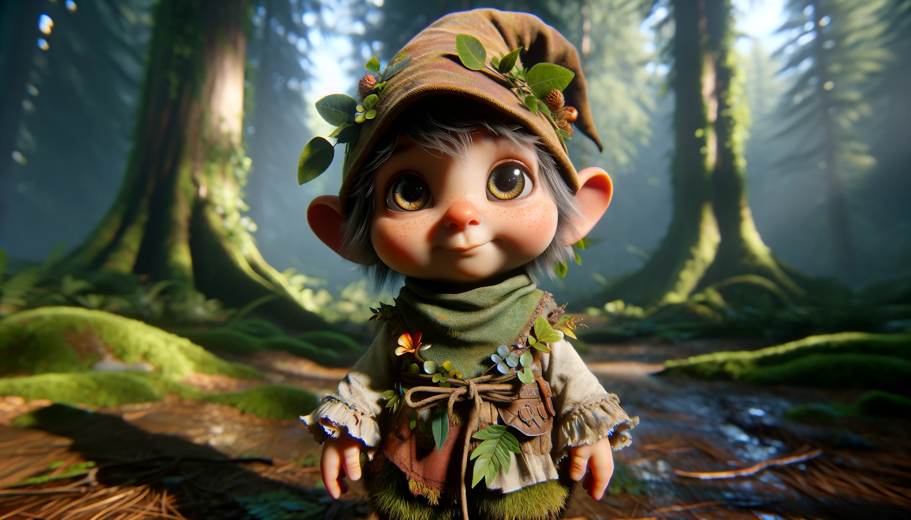

---

## Gnomes / Zwergen

### Overview

- **Brief Description:** Gnomes are a small, nature-connected race known for their whimsical character and deep bond with the forest.
- **Unique Feature:** Exceptional connection with nature, able to communicate with forest creatures and harness natural magic.

### Appearance

- **Physical Characteristics:** Small stature, typically not much taller than a human's knee. They have bright, expressive eyes and often feature earthy tones in their skin, hair, and eyes.
- **Style and Attire:** Their clothing is made from natural materials found in the forest, often decorated with leaves, flowers, and other forest elements, giving them a whimsical, organic look.

### Culture

- **Society:** Gnomes live in tight-knit communities deeply integrated into their forest environment, focusing on communal living and cooperation.
- **Values and Beliefs:** They value joy, harmony with nature, and the preservation of the forest. They believe in living a life filled with laughter and wonder.
- **Traditions:** Known for their vibrant festivals and celebrations, filled with music, dance, and nature-based rituals.

### Habitat

- **Preferred Environment:** Deep in secluded forest regions where they can live in harmony with the natural world.
- **Settlements:** Their homes are cleverly hidden within the forest, often built in the trees or underground, seamlessly blending with the natural surroundings.

### Abilities

- **Innate Skills:** Gnomes possess an innate ability to understand and communicate with forest creatures. They are also skilled in natural magic, particularly in areas of growth, healing, and protection.
- **Combat Prowess:** While not typically aggressive, they are capable of defending their homes using guerrilla tactics, employing their knowledge of the forest to outmaneuver larger foes.

### Relations with Other Races

- **Alliances and Conflicts:** Generally peaceful, gnomes prefer to avoid conflict but will fiercely defend their homes against threats. They maintain friendly relations with races that respect nature.
- **Role in Society:** Seen as guardians of the forest, they are often sought out for their knowledge of natural magic and healing.

### Gameplay Interaction

- **Playable Race:** Yes
- **NPC Interaction:** Players can interact with gnomes for quests involving forest exploration, gathering natural resources, or defending against threats to the forest.

### Lore and History

- **Backstory:** Gnomes believe they were born from the laughter of the forest, destined to protect and cherish their woodland home.
- **Role in Game's Lore:** They embody the spirit of joy and the importance of living in harmony with nature, adding depth and a sense of wonder to the world of Arcadia.
