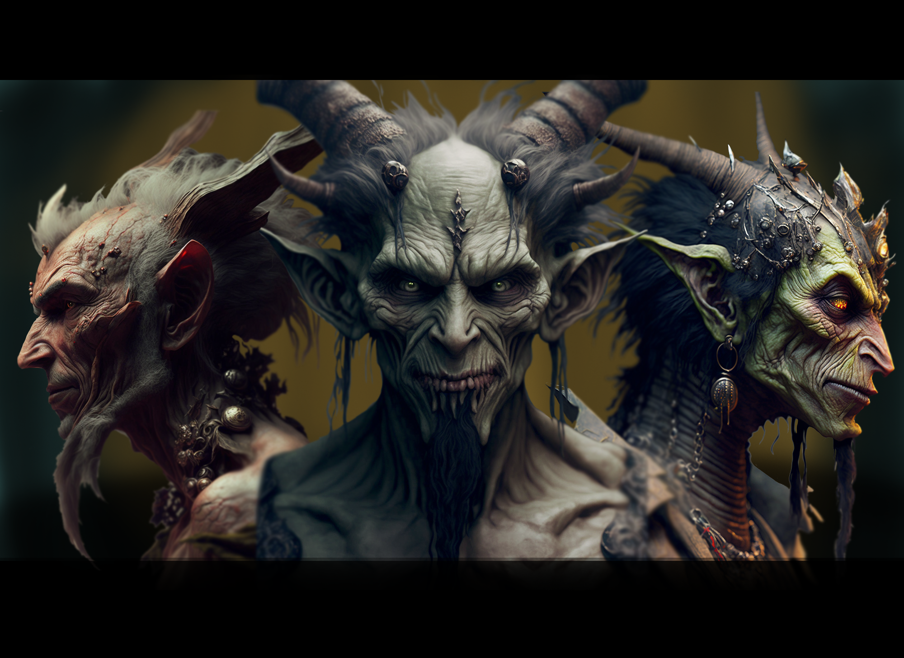

---

# Goblins

### Overview

- **Brief Description:** The goblins of Arcadia are a resilient and multifaceted race, known for their strength, cunning, and surprising heroism.
- **Unique Feature:** Goblins possess a remarkable ability to adapt and thrive in harsh environments, particularly subterranean realms.

### Appearance

- **Physical Characteristics:** Small in stature, goblins are typically wiry and agile, with sharp features and a variety of skin tones ranging from earthy greens to grays.
- **Style and Attire:** Their attire is often makeshift, utilizing materials found in their environment, reflecting their scavenging nature.

### Culture

- **Society:** Tribal and survival-oriented, with leadership based on a combination of strength, cunning, and resourcefulness.
- **Values and Beliefs:** Goblins value the survival and prosperity of their tribe, with a strong emphasis on adaptability and ingenuity.
- **Traditions:** Rich oral storytelling traditions that celebrate cunning heroes and tribal unity.

### Habitat

- **Preferred Environment:** Subterranean realms known as "The Gloom Warrens" or "The Shadowdeep," where they expertly navigate and utilize available resources.
- **Settlements:** Goblins build intricate networks of tunnels and makeshift dwellings, effectively utilizing the terrain for defense and sustenance.

### Abilities

- **Innate Skills:** Expert scavengers and hunters, adept in navigating through treacherous terrains and setting up ambushes.
- **Combat Prowess:** Skilled in guerrilla tactics, using their environment to their advantage in skirmishes and raids.

### Relations with Other Races

- **Alliances and Conflicts:** Goblins are wary of outsiders but open to alliances that benefit their survival. Their relations are dynamic, ranging from hostile to cooperative based on circumstances.
- **Role in Society:** Often misunderstood, goblins can be potential allies or adversaries, depending on the interactions and mutual interests.

### Gameplay Interaction

- **Playable Race:** No. Primarily NPCs that players can interact with through quests and diplomacy.
- **NPC Interaction:** Players can negotiate, ally, or conflict with goblins, with potential to influence their stance towards the player and other factions.

### Lore and History

- **Backstory:** Goblins have a long history of adapting to the harsh conditions of their realm, developing a unique culture and social structure as a result.
- **Role in Game's Lore:** Represent the diversity of life in Arcadia and the potential for unexpected alliances in seemingly hostile environments.
