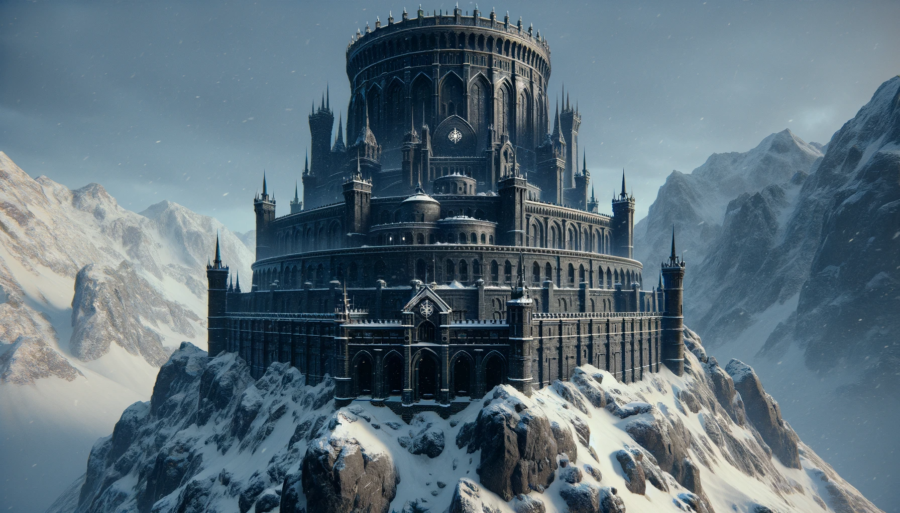

---

# The Grim Hold

### Overview

- **Brief Description:** The Grim Hold is a formidable fortress and the spiritual center of Aegis, serving as both a bastion against demonic forces and a sanctuary for its warriors and clerics.
- **Significance:** A symbol of unyielding resistance against darkness and a key stronghold in the eternal war against demonic incursions.

### Geography

- **Terrain Features:** Located atop a lonely, snow-covered mountain, its imposing structure stands in stark contrast to the harsh, unforgiving landscape.
- **Climate and Atmosphere:** The grim and solemn atmosphere is accentuated by the rugged mountain terrain and severe weather conditions.

### Culture and Society

- **Inhabitants:** Primarily occupied by the zealous warriors, clerics, and strategists of Aegis.
- **Lifestyle and Customs:** A disciplined and devout lifestyle, marked by continuous training, prayer, and vigilance.
- **Architecture and Structures:** Gothic architectural style, adorned with symbols of vigilance and battle, integrating spiritual significance with military functionality.

### Economy and Trade

- **Resources and Goods:** Self-sustained, relying on internal resources and supplies stockpiled to endure prolonged sieges.
- **Trade and Commerce:** Limited external trade, primarily focused on acquiring resources essential for defense and sustenance.

### Key Locations

- **Notable Areas:** The Grand Hall, Sanctuary of Eternal Vigilance, training grounds, War Room, Library of the Arcane, and the high-security prison for demonic entities.
- **Function of Key Locations:** Serve as centers for training, strategy, spiritual practices, and containment of dangerous beings.

### Threats and Challenges

- **Local Dangers:** Constant threat from demonic forces and the challenges posed by the mountainous terrain.
- **Political/Social Conflicts:** Internal dynamics of managing a fortress dedicated to an eternal crusade against evil.

### Role in Gameplay

- **Player Interaction:** Players may receive quests from the fortress, engage in training, or partake in rituals and ceremonies.
- **Impact on Player Experience:** Provides a deep insight into the lore of Aegis, the ongoing battle against demonic forces, and the spiritual aspects of Arcadia.

### Lore and History

- **Backstory:** Established as a bulwark against darkness, The Grim Hold has a history steeped in battles, sacrifices, and unwavering faith.
- **Significance in Game's Lore:** Represents the indomitable spirit of those who fight against the darkness, serving as a beacon of hope and resilience in Arcadia.
