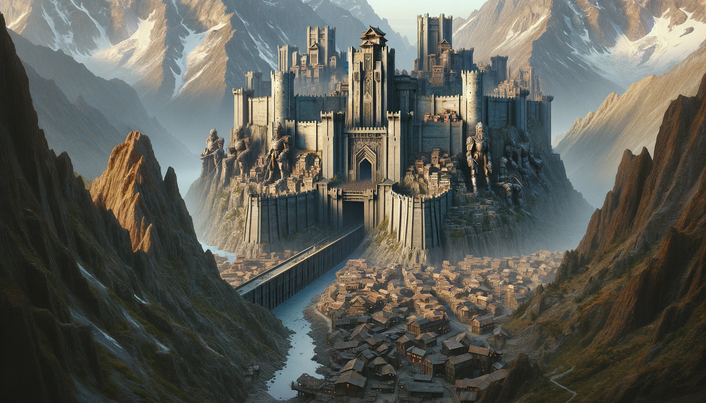

---

# Hardrun

### Overview

- **Brief Description:** Hardrun is a resilient and industrious mountain fortress, serving as a bulwark against the dangers from the underdark.
- **Significance:** A historical and strategic stronghold, known for its advanced smithing and mining, and as a frontline defense against subterranean threats.

### Geography

- **Terrain Features:** Built into a mountain, featuring steep terraces and rugged landscapes.
- **Climate and Atmosphere:** Harsh mountain climate, tempered by the warmth from forges and bustling industrial activity.

### Culture and Society

- **Inhabitants:** A diverse mix of races, predominantly miners, blacksmiths, and artisans.
- **Lifestyle and Customs:** Culture centered around craftsmanship and resilience, with a strong sense of community and shared purpose.
- **Architecture and Structures:** A mix of ancient engineering and modern fortifications, featuring stepped structures and Archanite-infused turrets.

### Economy and Trade

- **Resources and Goods:** Specializes in mining precious metals and crafting high-quality gear and weaponry.
- **Trade and Commerce:** Actively trades with other settlements and caravan guilds, exporting crafted goods and weaponry.

### Key Locations

- **Notable Areas:** The massive monolithic drawbridge, the Great Forge, the Arcadian Observatory, and the Archinite Forge.
- **Function of Key Locations:** Defense, craftsmanship, celestial observation, and advanced crafting.

### Threats and Challenges

- **Local Dangers:** Constant threat from the underdark creatures, resource depletion, and maintaining defenses.
- **Political/Social Conflicts:** Balancing the needs of various guilds and managing the political dynamics within the council.

### Role in Gameplay

- **Player Interaction:** Players learn crafting, engage in quests related to mining and smithing, and participate in defending the town.
- **Impact on Player Experience:** Introduces players to crafting systems, combat training, and the lore of Arcadia.

### Lore and History

- **Backstory:** Established on ancient ruins, Hardrun has grown into a key industrial and defensive settlement in Arcadia.
- **Significance in Game's Lore:** Represents the resilience and ingenuity of its inhabitants, standing as a testament to the enduring spirit of those who face the darkness below.
