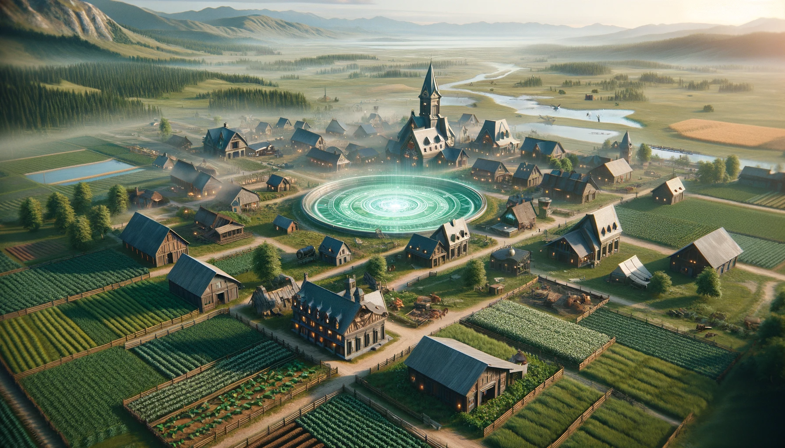

---

# Ravendale

### Overview

- **Brief Description:** Ravendale is a flourishing agrarian town, known as the food basket of Arcadia, protected by an Archanite energy shield and renowned for its seasonal festivals.
- **Significance:** A vital agricultural center with advanced protective technology, it transforms into a haven against supernatural threats during demonic incursions.

### Geography

- **Terrain Features:** Surrounded by expansive grasslands and farmlands, with the town located near a river flowing from Jericho.
- **Climate and Atmosphere:** Generally temperate, but subject to sudden dark, stormy weather due to nearby weather control device malfunctions.

### Culture and Society

- **Inhabitants:** Primarily farmers and townsfolk, with a mix of other residents drawn by the town's agricultural importance and unique festivals.
- **Lifestyle and Customs:** A community deeply connected to the land, celebrating agricultural success with grand festivals like the harvest festival and Samhain.
- **Architecture and Structures:** Rustic yet sturdy buildings, with the town center featuring more elaborate constructions showcasing the town's prosperity.

### Economy and Trade

- **Resources and Goods:** Major producer of a variety of crops and agricultural products, serving as a crucial food source for Arcadia.
- **Trade and Commerce:** Active trade routes via the river and land, exporting food and importing goods necessary for town maintenance and festivities.

### Key Locations

- **Notable Areas:** The town square for festivals, the agricultural academy, the messenger guild, and the central control hub for the Archanite shield.
- **Function of Key Locations:** Centers for trade, education, festival celebrations, and town defense.

### Threats and Challenges

- **Local Dangers:** Vulnerable to supernatural threats during demonic incursions, leading to the appearance of Halloween-themed monsters like vampires and werewolves.
- **Environmental Hazards:** Occasional wild tornadoes and darkness due to malfunctioning weather control devices.

### Role in Gameplay

- **Player Interaction:** Players can participate in agricultural activities, seasonal festivals, and defend the town during supernatural incursions.
- **Impact on Player Experience:** Offers a blend of peaceful farming life, festive celebrations, and intense defensive battles against supernatural creatures.

### Lore and History

- **Backstory:** Established as a simple farming community, Ravendale evolved into a key agricultural town, adapting advanced technology for protection.
- **Significance in Game's Lore:** Symbolizes the balance between nature and technology, and the resilience of communities in the face of supernatural threats.
